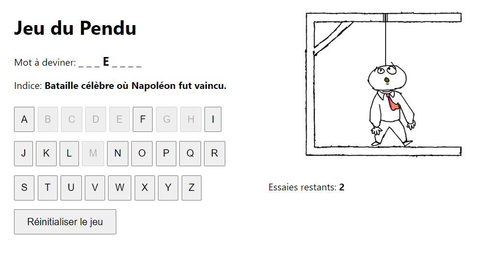

# Jeu du Pendu en React avec Redux et React Router

## Description

Ce projet est une implémentation du jeu du pendu utilisant React pour le front-end, Redux pour la gestion de l'état et React Router pour la navigation. Le jeu sélectionne un mot aléatoire avec sa définition à partir d'un fichier JSON pour chaque partie.

## Fonctionnalités

- Jouer au jeu du pendu avec un mot aléatoire
- Voir la définition du mot à deviner
- Réinitialiser le jeu
- Navigation vers une page de félicitations si le mot est deviné correctement
- Navigation vers une page d'échec si les tentatives sont épuisées

## Installation

1. Clonez le dépôt :

    ```bash
    git clone https://github.com/votre-utilisateur/react-redux-hangman.git
    cd react-redux-hangman
    ```

2. Installez les dépendances :

    ```bash
    npm install
    ```

## Démarrage

Pour démarrer l'application en mode développement, exécutez :

```bash
npm start
```

## Screenshots 




## Licence

MIT
