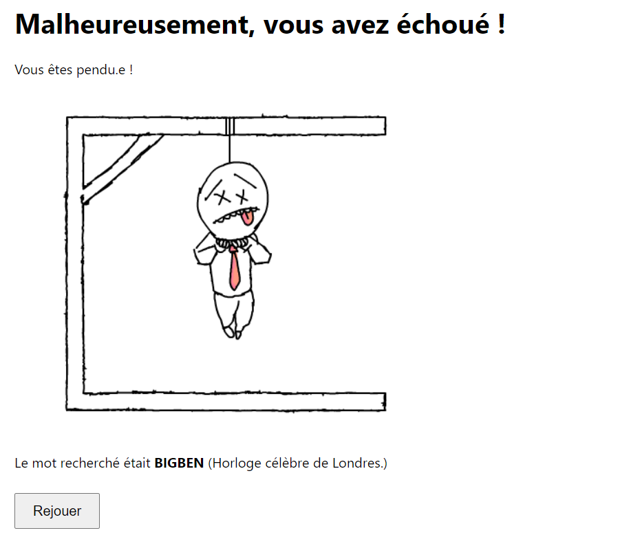

# 🎉 Jeu du Pendu en React avec Redux et React Router


## 🚀 Pour tester
<a href="https://andriantomanga.github.io/react-redux-hangman" target="_blank">Voir le jeu en ligne</a>


## 📝 Description

Ce projet est une implémentation du jeu du pendu utilisant React pour le front-end, Redux pour la gestion de l'état et React Router pour la navigation. Le jeu sélectionne un mot aléatoire avec sa définition à partir d'un fichier JSON pour chaque partie.

## 🌟 Fonctionnalités

- 🔠 Jouer au jeu du pendu avec un mot aléatoire
- 📖 Voir la définition du mot à deviner
- 🔄 Réinitialiser le jeu
- 🎉 Navigation vers une page de félicitations si le mot est deviné correctement
- ❌ Navigation vers une page d'échec si les tentatives sont épuisées

## 🛠️ Installation

1. Clonez le dépôt :

    ```bash
    git clone https://github.com/votre-utilisateur/react-redux-hangman.git
    cd react-redux-hangman
    ```

2. Installez les dépendances :

    ```bash
    npm install
    ```

## ▶️ Démarrage

Pour démarrer l'application en mode développement, exécutez :

```bash
npm start
```

## 📸 Screenshots 

 



## 🗝️ Licence

MIT
